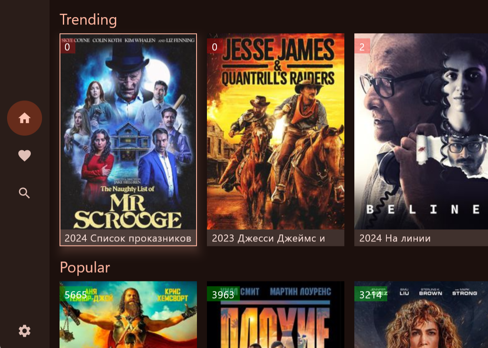
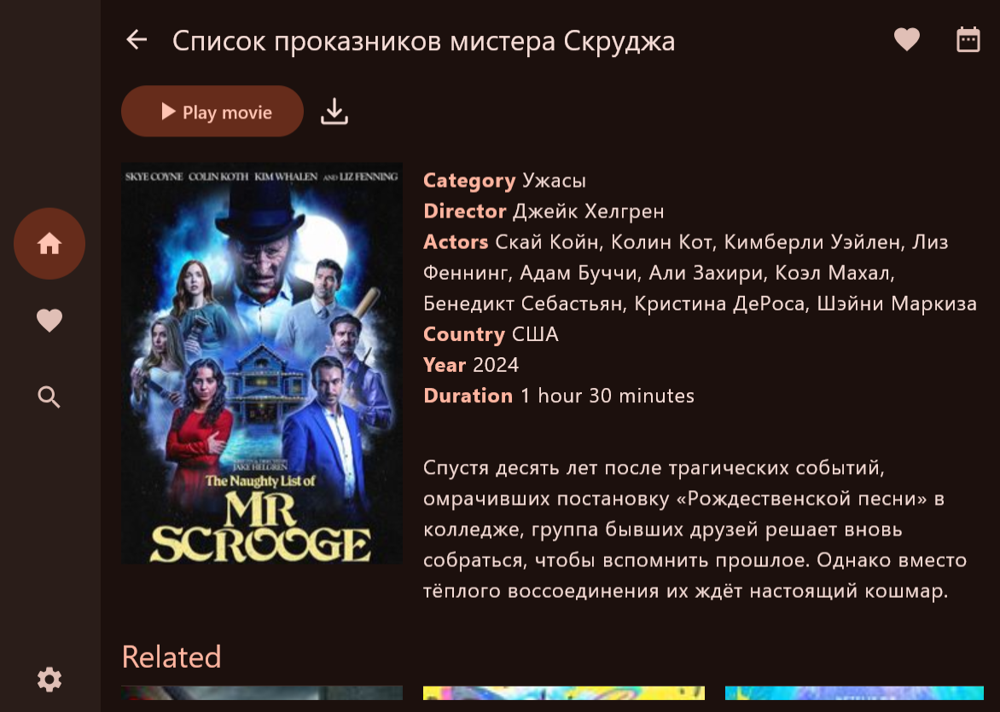
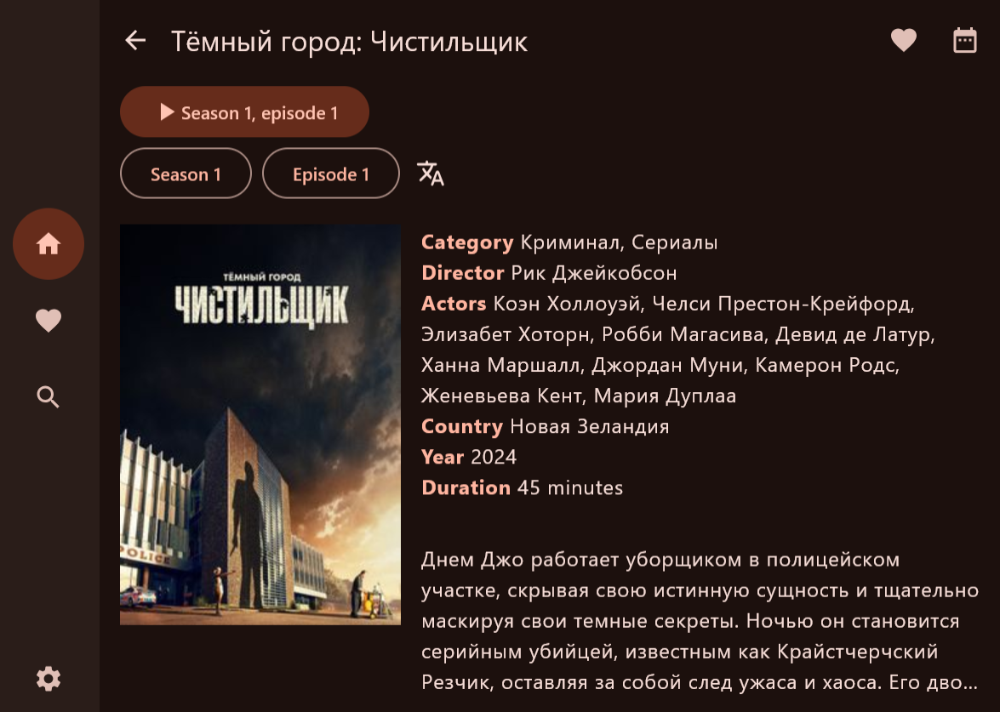

# Filmix

The project provides cross platform application for the Filmix video service available on the following platforms:

* Android: mobile and TV
* iOS: mobile
* Desktop: any platform with JRE runtime and VLC player

## Getting started

Install the application, open Settings screen to proceed with authentication.

## Screenshots

## Contribution

This is a Kotlin Compose Multiplatform project targeting Android, iOS, Desktop.

* `/composeApp` is for code that will be shared across your Compose Multiplatform applications.
  It contains several subfolders:
  - `commonMain` is for code that’s common for all targets.
  - Other folders are for Kotlin code that will be compiled for only the platform indicated in the folder name.
    For example, if you want to use Apple’s CoreCrypto for the iOS part of your Kotlin app,
    `iosMain` would be the right folder for such calls.

* `/iosApp` contains iOS applications. Even if you’re sharing your UI with Compose Multiplatform, 
  you need this entry point for your iOS app. This is also where you should add SwiftUI code for your project.

Learn more about [Kotlin Multiplatform](https://www.jetbrains.com/help/kotlin-multiplatform-dev/get-started.html)

This technical prototype uses the following Compose MPP libraries:
* Voyager - navigation, view models
* Koin - DI
* Ktor - HTTP client
* Settings - app preferences
* VideoPlayer - which uses `media3-exoplayer` (Android), `AVPlayer` (iOS), `VLC` (Desktop)
* Kamel to display images
* QRCode renderer/scanner
* Localization: `stringResource`/`pluralStringResource`
